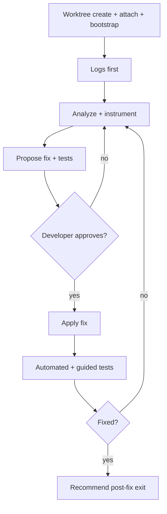

# Debug and fix

**Intent:** **Debug and Fix agent** runs a log-first diagnosis and fix loop in a dedicated hosting-repo worktree. Prioritize log access and debug instrumentation before substantive analysis. When the fix is verified, recommend a post-fix exit: **`code-promotion`** (parent creates a PR plan anchor through **new-plan/pr-plan**, then runs **coding-session** with `targetPlanPath`), **`ad-hoc-prd`** (parent captures fix context without immediate code promotion), or **`findings-report-only`** (parent produces a debug session findings report with no downstream spawn).

**Normative mode:** **Spawned only** on this mission — child lane owns worktree lifecycle for the debug session unless protocol explicitly re-spawns **`coding-session`** for promotion.

## Agent messaging (MCP)

**MCP spawn/result skill.** Parent→child spawn and child terminal result use MCP tools per **`.sedea/centers/sedea/rules/4_mission.mdc`** § *Agent-to-agent spawn protocol*.

| Action | MCP tool |
|--------|----------|
| Squad Leader spawn for this skill | **`mission_control_spawn_agent`** |
| **This** spawned lane terminal (and terminal re-emits) | **`mission_control_send_agent_result`** |

**Binding:** **Forbidden** host-resolved identity keys in MCP args (`correlationId`, `dispatchId`, `slotId`, … — see **`.sedea/centers/sedea/rules/4_mission.mdc`** § *Host-resolved identity*).

## Inputs

| Field | Required | Notes |
|-------|----------|-------|
| `issueSummary` | Yes | Symptom or bug description |
| `reproductionSteps` | No | Reproduction narrative |
| `logHints` | No | Where to look first |
| `repoPath` | No | **`HOSTING_ROOT`** — resolve from workspace when omitted |
| Dispatch scope | Yes | Mission Control `dispatchId` + bundle directory |

## Execution diagram



## Structured choice (Mission Control)

Under Checkpoint trust, structured choice at **USER_CHECKPOINT** markers in **`## Checkpoint turn UX (skill-local)`** uses **AskQuestion** or **`mission_control_present_structured_choice`** per [`.sedea/centers/sedea/rules/2_ask-question-instructions.mdc`](.sedea/centers/sedea/rules/2_ask-question-instructions.mdc). **Forbidden:** closing every assistant turn with a modal on happy-path steps — auto-advance per the Checkpoint table. Step **7** confirmation of **`exitRecommendation`** (or abandon) is binding **Squad Leader auto-approval** under Checkpoint trust — mission **§4** is skipped when the child confirms; the leader may still override when the exit was missing or ambiguous.

## Checkpoint turn UX (skill-local)

Under Checkpoint trust (`trustLevel: checkpoint`), auto-advance scripted happy-path steps; emit structured choice only at **USER_CHECKPOINT** markers in this section, implicit external-wait surfaces, or exception paths. **No cross-skill inheritance** — gate defaults here apply only to **`debug-and-fix`**; invoker mission **`debug-and-fix`** documents Squad Leader gates — see **`debug-and-fix/plan.mdc`** §3 child handover, §4 post-fix exit, and cross-mission spawns to **`plan-and-deliver`** skills (**`new-plan`**, **`pr-plan`**, **`coding-session`**, **`ad-hoc-prd`**) in §§5–5c.

**Real-dispatch test loop (binding):** After merge, run one full **`debug-and-fix`** spawn on a Checkpoint dispatch through [Fix proposal gate](#fix-proposal-gate-binding) and [Manual test verification gate](#manual-test-verification-gate-binding) and collect a developer verdict before the parent phase advances the next skill PR — per **Debug mission skills UX** § *Single-concern strategy*.

Marker syntax: [`.sedea/centers/sedea/docs/user-checkpoint-marker-syntax.md`](.sedea/centers/sedea/docs/user-checkpoint-marker-syntax.md).

| Step | Checkpoint behavior | Gate |
|------|---------------------|------|
| **1** — Resolve paths and worktree name | Auto-advance | — |
| **2** — Worktree create, attach, bootstrap | Auto-advance on happy path after success-class **`bootstrapStatus`** | **Gate** on setup/bootstrap failure — [Bootstrap retry gate](#bootstrap-retry-gate-binding) |
| **3** — Logs first | Auto-advance through log collection and instrumentation | exception: missing log access → `blocked` terminal |
| **4** — Analyze and propose fix | **Gate** — developer approves fix proposal before implementation | [Fix proposal gate](#fix-proposal-gate-binding) |
| **5** — Apply fix | Auto-advance automated tests on happy path | **Gate** for each manual test scenario — [Manual test verification gate](#manual-test-verification-gate-binding); **waiting** when developer runs tests outside chat; optional **Deploy Step Verification** agent handoff ([§ agent handoff](#deploy-step-verification-agent-handoff-binding)) |
| **6** — Fix loop | Auto-advance routing back to step **3** or forward to step **7** | exception: `blocked` → terminal with evidence |
| **7** — Post-fix recommendation + terminal | **Gate** — confirm **`exitRecommendation`** or abandon (binding Squad Leader auto-approval); then worktree path recap + bubble-up | Confirmation on this lane skips mission **§4**; leader override only when exit missing/ambiguous |

## Session orientation table (binding)

Give developers a **consistent state snapshot** during debug gates so they can re-orient after reload or parallel work.

**When required:** At [Fix proposal gate](#fix-proposal-gate-binding) and [Manual test verification gate](#manual-test-verification-gate-binding) — render as the **first block** in `display.markdown`. **Forbidden:** omitting the table and substituting scattered one-liners on modal gates.

**Table shape (markdown):**

| Field | Value |
|-------|-------|
| Issue | `<issueSummary>` truncated or — |
| Worktree | `<worktreePath>` from setup hints |
| Branch | `<worktreeName>` from setup hints or — |
| Fix phase | `diagnose` · `propose` · `apply` · `verify` |
| Bootstrap | `<outputs.bootstrapMode>` · `<outputs.bootstrapStatus>` |
| Tests | automated pending · manual pending · verified · failed |

**Population rules:** Use spawn `inputs` and setup JSON hints; never invent paths.

## Steps

### 1 — Resolve paths and worktree name

1. Set **`HOSTING_ROOT`** = `repoPath` or workspace root containing `.sedea/centers/sedea/`.
2. Derive **`worktreeName`** per [`.sedea/centers/sedea/rules/7_stacked-pr-worktree-naming.mdc`](.sedea/centers/sedea/rules/7_stacked-pr-worktree-naming.mdc) — default non-stacked: `improve/debug-and-fix-<short-slug>` from issue summary.
3. Choose sibling **`WORKTREE_ROOT`** path per team convention (outside **`HOSTING_ROOT`** checkout tree).

- **Next-step resolution:** Auto-advance to step **2** — no `USER_CHECKPOINT` on this step.

### 2 — Worktree create, attach, bootstrap (binding)

Follow [`.sedea/centers/sedea/rules/0_hosting-repo.mdc`](.sedea/centers/sedea/rules/0_hosting-repo.mdc) § *Attach worktree to VS Code workspace*, [`.sedea/centers/sedea/skills/worktree-setup/SKILL.md`](../../../../../sedea/skills/worktree-setup/SKILL.md), and [rule **20**](.sedea/centers/research-and-development/rules/20_efficient-pr-shipping.mdc) § *Worktree setup in plans* / *Bootstrap profiles*:

| Step | Action |
|------|--------|
| 1 | From **`HOSTING_ROOT`**, run center **`worktree-setup.sh`** with `--hosting-root`, `--worktree-path` (absolute **`WORKTREE_ROOT`** from step **1**), `--worktree-name`, `--base-ref origin/main`. **Forbidden on the default path:** inline **`git worktree add`**. |
| 2 | Parse the **one JSON line on stdout**. Set **`WORKTREE_ROOT`** from hint **`worktreeRoot`**. When hint **`bootstrapStatus`** is **`success`**, **`skipped-noop`**, or **`skipped-idempotent`**, set **`outputs.bootstrapStatus: success`** and **`outputs.bootstrapMode`** from the hint. **Do not** run inline [`worktree-bootstrap/SKILL.md`](../../../plan-and-deliver/skills/worktree-bootstrap/SKILL.md) after successful setup. |
| 3 | When JSON **`nextAction`** is **`attach-required`**, MCP **`sedea_add_worktree_folder`** with absolute **`WORKTREE_ROOT`**. **Forbidden:** attach before setup exits **0**. |

**Exception (inline retry only):** When step **1** fails or bootstrap is not success-class, stop product edits and offer retry per rule **20** § *Bootstrap profiles* — inline deprecated [`worktree-bootstrap/SKILL.md`](../../../plan-and-deliver/skills/worktree-bootstrap/SKILL.md) **only** when setup failed and the developer attests retry (not spawn-by-default).

Do **not** edit product code before **`outputs.bootstrapStatus: success`**.

- **Next-step resolution:** Auto-advance to step **3** on happy path — no `USER_CHECKPOINT` until [Bootstrap retry gate](#bootstrap-retry-gate-binding) when setup or bootstrap is not success-class.

#### Bootstrap retry gate (binding)

When center **`worktree-setup.sh`** exits non-zero or hint **`bootstrapStatus`** is not success-class, close the turn with structured choice **before** product edits or log analysis.

**When required:** Exception-only retry path after setup failure. **Forbidden:** opening this gate when setup already reported success-class **`bootstrapStatus`**. **Forbidden:** prose-only bootstrap recap without this gate under Checkpoint trust.

Put resolved **`WORKTREE_ROOT`**, **`HOSTING_ROOT`**, **`outputs.bootstrapMode`**, and any attested **`bootstrapSkipFlags`** in **`display.markdown`**.

USER_CHECKPOINT — pick bootstrap retry or defer before continuing debug work on this lane.

| Option id | Label (brief) | Act |
|-----------|---------------|-----|
| `retry-center-setup` | Retry center worktree-setup.sh | Re-run step **2** substeps **1–3** |
| `retry-inline-bootstrap` | Retry inline worktree-bootstrap (attested) | Follow inline [`worktree-bootstrap/SKILL.md`](../../../plan-and-deliver/skills/worktree-bootstrap/SKILL.md) per rule **20** |
| `retry-with-skip-flags` | Retry with attested `--skip-*` flags | Re-run setup with updated **`bootstrapSkipFlags`** |
| `defer-debug` | Defer — return partial to Squad Leader | Emit **`partial`** with **`continuationStatus: active`**; no product edits |
| `more-details` | More details for option _ | Elaborate; re-open this gate |

- **`defaultOptionId: retry-center-setup`** when failure looks transient and paths are valid.
- **Next-step resolution:** Auto-advance to step **3** when **`outputs.bootstrapStatus: success`** — no `USER_CHECKPOINT` on the default happy path.

### 3 — Logs first (mandatory gate)

**Do not start substantive root-cause analysis until log access is established.**

1. Read [`.cursor/rules/sedea-debug-logging-settings.mdc`](.cursor/rules/sedea-debug-logging-settings.mdc) when present on the hosting repo — follow its **cwd routing** table before tuning any channel.
2. When the bug is under **`tapcart-push/`** or **`tapcart-merchant-dashboard/`**, read that submodule's logging rules first (for example [`tapcart-push/.cursor/rules/logging.mdc`](tapcart-push/.cursor/rules/logging.mdc) — `LOG_LEVEL`, pino).
3. When the bug is **Mission Control**, **Sedea Hub**, or dispatch/agent lanes — tune `sedeaHub.logLevel`, `missionControl.logLevel`, and Output panel sinks per that router; inspect `.sedea/operations/.../dispatch/` on the **primary** clone when lane evidence is needed.
4. Collect existing logs relevant to `issueSummary` / `logHints`.
5. Add **liberal debug logging** to code under **`WORKTREE_ROOT`** when existing logs are insufficient — verbose debug output is acceptable for this stage.
6. Reproduce using `reproductionSteps` when provided; capture log evidence before proposing fixes.

**Node toolchain:** when running `node` / `npm` / `yarn` in a submodule during diagnosis, use that repo's declared version (`fnm use` when `.node-version` or `.nvmrc` exists) per [`.cursor/rules/dot-sedea.mdc`](.cursor/rules/dot-sedea.mdc) — not a separate hosting-root warmUp rule.

- **Next-step resolution:** Auto-advance to step **4** when log access is established — no `USER_CHECKPOINT` on this step (agent procedural gate, not developer-input).

### 4 — Analyze and propose fix

1. Analyze code with log evidence — prioritize log-backed hypotheses.
2. Propose fix with explicit **testing scenarios** (automated and manual).
3. Close turn with structured choice at [Fix proposal gate](#fix-proposal-gate-binding) — developer approves fix proposal, requests revision, or aborts.

- **Next-step resolution:** Auto-advance to step **5** only after **`approve-fix`** at the fix proposal gate — revision loops return to step **4** analysis.

#### Fix proposal gate (binding)

After log-backed analysis and a concrete fix proposal with test scenarios, close the turn with structured choice **before** implementing under **`WORKTREE_ROOT`**.

**When required:** Every fix proposal before step **5** implementation. **Forbidden:** applying product edits before developer approval. **Forbidden:** prose-only *approve this fix?* without **`mission_control_present_structured_choice`** / AskQuestion under Checkpoint trust.

Include [Session orientation table (binding)](#session-orientation-table-binding) as the first block in **`display.markdown`**. Recap: hypothesis, proposed change scope, automated test plan, manual test scenarios.

USER_CHECKPOINT — approve fix proposal, request revision, or abort on this lane. defaultOptionId: approve-fix

| Option id | Label (brief) | Act |
|-----------|---------------|-----|
| `approve-fix` | Approve — implement fix (step 5) | Proceed to [Apply fix](#5--apply-fix-after-approval) |
| `revise-proposal` | Revise proposal — more analysis | Return to step **4** substeps **1–2** |
| `abort-debug` | Abort debug session | Terminal **`aborted`** with evidence recap |
| `more-details` | More details for option _ | Elaborate; re-open this gate |

### 5 — Apply fix (after approval)

1. Implement approved fix only under **`WORKTREE_ROOT`**.
2. Run automated tests applicable to the change.
3. Guide developer through manual test scenarios step-by-step via [Manual test verification gate](#manual-test-verification-gate-binding).

- **Next-step resolution:** Auto-advance automated test runs on happy path — open manual test gate per scenario; auto-advance to step **6** / **7** when all scenarios pass.

#### Manual test verification gate (binding)

For each manual test scenario from the approved proposal, close the turn with structured choice when the developer must confirm results — including when they run tests **outside chat** (external-wait resume on return).

**When required:** Each manual scenario before marking **`fixStatus: verified`**. **Forbidden:** prose *tell me when tests pass* — use structured resume options.

Include [Session orientation table (binding)](#session-orientation-table-binding) as the first block. Set **Tests** row to the active scenario id.

USER_CHECKPOINT — confirm manual test scenario results on this lane.

| Option id | Label (brief) | Act |
|-----------|---------------|-----|
| `scenario-pass` | Scenario passed — continue | Advance to next scenario or step **6** when all pass |
| `scenario-fail` | Scenario failed — return to diagnosis | Return to step **3** (logs first on new evidence) |
| `run-tests-outside-chat` | Running tests outside chat — resume when done | External-wait — same gate on resume with results |
| `copy-dsv-handoff` | Copy Deploy Step Verification agent prompt | Emit [Deploy Step Verification (agent handoff)](#deploy-step-verification-agent-handoff-binding) in the same turn’s **`displayMarkdown`** (or re-emit if already shown); re-open this gate — does **not** mark the scenario passed |
| `blocked-manual` | Blocked — cannot complete manual test | Set **`fixStatus: blocked`**; terminal with evidence |
| `more-details` | More details for option _ | Elaborate; re-open this gate |

##### Deploy Step Verification (agent handoff) (binding)

When manual scenarios need an **agent** to verify them (especially when **no** PR-plan `## 7. Deploy test plan` anchor exists yet), emit a copy-safe prompt for a **detached** Mission Control dispatch of **Perform Deploy Step Verification** (`sedea-for-testing` / `perform-deploy-step-verification` — command phrase **`perform deploy step verification`**). Confirm that center exists on the hosting repo before naming the path; if it is missing, say so and keep user-facing gate options.

**When to emit**

| Trigger | Rule |
|---------|------|
| Developer picks **`copy-dsv-handoff`** | **Must** include the fenced handoff block in **`displayMarkdown`** on that turn |
| First manual-test gate of the session when scenarios are agent-executable (commands, logs, HTTP, introspection) and **no** `targetPlanPath` is in scope | **Should** include the handoff block proactively in **`displayMarkdown`** above the modal (developer may still use user-facing options) |

**Forbidden**

- Treating developer-facing scenario bullets (“open the UI and confirm …”) as the agent handoff body
- Implying this mission **spawns** Deploy Step Verification — the developer starts a **new** Mission Control dispatch (detached)
- Requiring a PR-plan path when debug has none — free-form checklist intake is valid for DSV
- Prose-only “paste something into Deploy Step Verification” without the fenced agent prompt

**Prompt shape (LLM consumer — agent-targeted)**

Put this under a `### Deploy Step Verification (agent handoff)` heading. Optimize for an agent reader (rule **1** § *Generating content for another agent*): completeness over brevity. Fill placeholders from the approved proposal and known env.

````markdown
### Deploy Step Verification (agent handoff)

Copy into a **new** Mission Control dispatch on center **`sedea-for-testing`**, mission **Perform Deploy Step Verification**.

```text
perform deploy step verification

## Goal
Verify the following debug-session manual scenarios for the fix under test. Prefer autonomous checks (shell, HTTP, log grep, introspection). Do not ask the developer to run commands you can run.

## Context
- Hosting root: <absolute HOSTING_ROOT>
- Debug worktree (if product fix lives there): <absolute WORKTREE_ROOT>
- Worktree name: <worktreeName>
- Environment: <local|staging|… or unknown>
- PR plan deploy anchor: <targetPlanPath or "none — free-form checklist below">

## Scenarios to verify
1. <scenario id / title> — success: <one-line criteria>
2. …

## How to verify (agent)
For each scenario:
- Run concrete commands or scripts (name argv; cwd under HOSTING_ROOT or WORKTREE_ROOT as appropriate).
- Use log tail/grep, HTTP probes, or read-only introspection when UI is not required.
- Record pass/fail + evidence per scenario.
- Authorized ops hint: shell, http, log-grep, read-only-db, write-scratch (narrow further if known).

## Out of scope
- Do not re-implement the product fix.
- Do not mark debug-and-fix scenarios passed — report results back so the developer can pick scenario-pass / scenario-fail on the debug lane.
```
````

After the developer runs DSV and returns, they resume this gate with **`scenario-pass`** / **`scenario-fail`** (or **`run-tests-outside-chat`** while waiting).

### 6 — Fix loop

- If issue persists or a new issue appears → return to step **3** (logs first on new evidence).
- If blocked (missing access, unrecoverable env) → set `fixStatus: blocked` and terminal with evidence.

- **Next-step resolution:** Auto-advance routing — no `USER_CHECKPOINT` on loop hops; gates live at steps **4** and **5** only.

### 7 — Session cleanup vs post-fix recommendation

When fix is verified:

| Worktree / fix state | `exitRecommendation` | Rationale for parent |
|----------------------|---------------------|----------------------|
| Clean fix, ready to ship | `code-promotion` | Parent creates a PR plan anchor with **new-plan/pr-plan**, then runs **coding-session** with `targetPlanPath` (mission steps 5–5b) |
| Fix verified; product-context capture is useful before promotion decisions | `ad-hoc-prd` | Parent spawns **ad-hoc-prd** only (mission step 5c) — no **coding-session** until the developer later selects code promotion |
| Fix verified; shipping deferred, noisy unrelated changes, or scope needs triage | `findings-report-only` | Parent produces **Debug session findings report** (mission step 6) — no downstream spawn |
| Blocked before verification | `blocked` | Terminal with evidence; parent routes to findings report |
| Developer abandons the debug session | _(set `abandonMission: true`; MCP `status: abandoned`)_ | Parent auto-proposes dispatch **`abandoned`** — no §4 exit modal |

For `code-promotion`, include enough `fixSummary` and `testEvidence` detail for the parent to seed the standalone PR plan anchor. The parent must create or populate a PR plan before spawning **`coding-session`**; do not imply that the debug worktree alone is sufficient for ship-chain handoff.

Present structured choice confirming recommendation **or abandon**. When the developer confirms, that terminal signal is binding **Squad Leader auto-approval** under Checkpoint trust — mission **§4** is skipped and the leader routes per mission **§3 resume** without a repeat exit modal:

| Confirmed signal | Squad Leader auto-advance |
|------------------|---------------------------|
| `exitRecommendation: code-promotion` | **§5** spawn **`new-plan`** + **`pr-plan`** |
| `exitRecommendation: ad-hoc-prd` | **§5c** spawn **`ad-hoc-prd`** |
| `exitRecommendation: findings-report-only` | **§6** findings report |
| `exitRecommendation: blocked` or `fixStatus: blocked` / `failed` | **§6** findings report |
| `abandonMission: true` or MCP `status: abandoned` / `aborted` | Propose dispatch **`abandoned`** |

Developer may still override on the leader lane at mission **§4** when the exit was missing or ambiguous.

USER_CHECKPOINT — confirm post-fix **`exitRecommendation`** or abandon on this lane.

- **Next-step resolution:** After confirmation (or abandon), auto-advance to step **8** worktree path recap then [Squad Leader bubble-up](#squad-leader-bubble-up-binding) on the same turn.

### 8 — Worktree path recap (binding — before terminal result)

Immediately before **`mission_control_send_agent_result`** (terminal or re-emit):

1. Resolve absolute **`WORKTREE_ROOT`** from setup hint **`worktreeRoot`** or expanded filesystem path — **forbidden:** truncated paths, dirname-only references, or relative paths in the copy-paste block.
2. In the same turn's developer-facing recap (`displayMarkdown` when using MCP structured choice, or brief prose with AskQuestion), include:

```markdown
### Worktree (copy-paste)

**Path:**
```
<absolute WORKTREE_ROOT>
```

**Name:** `<worktreeName>`
**Hosting root:** `<absolute HOSTING_ROOT>`
```

3. Set **`outputs.worktreePath`** to the same absolute path string shown in the fenced block.
4. **Forbidden:** terminal MCP result as the only surface for **`worktreePath`** — the developer must see the fenced absolute path before parent handoff.

## Squad Leader bubble-up (binding)

Runs on a **spawned** debug child lane; the **debug-and-fix** Squad Leader waits on **#external-wait** until terminal **`mission_control_send_agent_result`** host sync.

### Auto terminal + parent refocus (binding — all outcomes)

After step **7** confirmation and step **8** worktree path recap ( **`fixStatus: verified`**, **`partial`**, **`failed`**, **`blocked`**, or abandoned ):

**Same turn** (recap prose may precede MCP calls):

1. Call **`mission_control_refocus_parent_lane`** (optional `{ "reason": "debug-and-fix-complete" }` — no host-resolved identity keys).
2. Emit terminal **`mission_control_send_agent_result`** as the **last** MCP call per [Completion (spawned)](#completion-spawned).

Populate terminal **`outputs`** with full debug result — including **`exitRecommendation`**, **`fixSummary`**, **`testEvidence`**, and worktree paths. When step **7** confirmation already bound Squad Leader auto-approval, the leader routes per mission **§3 resume** without repeating **§4**; when confirmation was skipped or ambiguous, the leader opens **`plan.mdc`** §4 / §3 as applicable.

**Forbidden at terminal:** a second post-fix exit **`USER_CHECKPOINT`** after step **7** already confirmed; prose-only handback without MCP result; **`mission_control_propose_dispatch_resolution`** on this lane.

## Completion (spawned)

| Output | Meaning |
|--------|---------|
| `fixStatus` | `verified` \| `partial` \| `failed` \| `blocked` |
| `fixSummary` | What was wrong and what changed |
| `testEvidence` | Automated + manual test outcomes |
| `worktreePath` | Absolute **`WORKTREE_ROOT`** |
| `worktreeName` | Branch / worktree name |
| `hostingRoot` | Absolute **`HOSTING_ROOT`** |
| `bootstrapStatus` | `success` \| `failed` \| `pending` — from center setup JSON hints (default path) or inline retry |
| `bootstrapMode` | Hosting overlay mode when reported by setup hints |
| `exitRecommendation` | `code-promotion` \| `ad-hoc-prd` \| `findings-report-only` \| `blocked` |
| `abandonMission` | `true` when the developer abandons the debug session (pair with MCP `status: abandoned`) |
| `remainingTasks` | Open items for parent or developer |

When `exitRecommendation: code-promotion`, `fixSummary` and `testEvidence` must be suitable for PR-plan seeding: name the verified change, affected areas, automated/manual test evidence, and any deploy-test considerations discovered during debugging. If that evidence is incomplete, prefer `findings-report-only` or include the missing evidence in `remainingTasks`.

### MCP result preflight (`mission_control_send_agent_result`)

| Step | Check |
|------|--------|
| R1 | Call **`mission_control_send_agent_result`** with **`status`**, **`summary`**, optional **`outputs`** / **`errors`** |
| R2 | **Forbidden args absent** — no **`correlationId`**, **`dispatchId`**, **`slotId`**, or other host-resolved keys |
| R3 | Populate **`outputs`** from the required field list above |
| R4 | Re-emit updated MCP result after user-requested follow-up on this lane (same spawn session; host resolves **`correlationId`**) |

Stop after the MCP result call. Do not emit another **`mission_control_spawn_agent`** on this lane (see **`../README.md`** § *Terminal stop (normative)*).

## Completion (inline)

Not used on this mission — **spawned only**.
