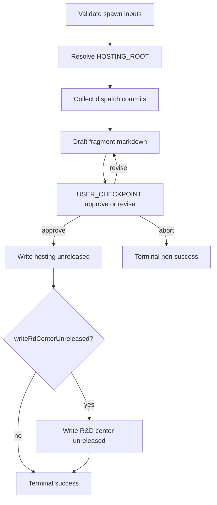

# Capture release note

**Spawn-only (binding).** Squad Leaders spawn this skill **once per dispatch** when the hosting overlay sets **`releaseVersions: release-versions`** and commits landed — see [`../plan.mdc`](../../plan.mdc) § *Release-versions dissolve gate*. Mission Control validates frontmatter **`inputs`** at spawn time. **Forbidden:** running this skill **inline** on the Squad Leader lane as a substitute for the once-per-dispatch child; inventing a second spawn after terminal **`success`**; landing or editing a skill body under **`.sedea/centers/sedea/skills/`** or **`sedea-builtin-center`**.

**Owns:** generate → structured approve/revise → write unreleased fragment(s) → terminal **`mission_control_send_agent_result`** with **`releaseNoteStatus`** signal for the dissolve gate.

**Out of scope:** overlay enablement; bump/sentinel consolidation; GitHub Release publish; Master Plan / phase planning; dispatch resolution.

## Warm-up manifest (spawned)

Per [`.sedea/centers/sedea/docs/lane-manifest-contract.md`](.sedea/centers/sedea/docs/lane-manifest-contract.md) and **`../README.md`** § *Default warm-up*. Host merge: `effectiveWarmUp = dedupe(bootstrapRules → laneRules → skillWarmUp)`. **No `alwaysApply` frontmatter flip.**

### `bootstrapRules` — host-resolved (R&D layer)

| Path | Purpose |
|------|---------|
| `.sedea/centers/research-and-development/rules/bootstrap.mdc` | Sole R&D `alwaysApply: true` bootstrap (≤10 KB); host merges when `centerSlug === research-and-development` |

### `skillWarmUp` — frontmatter `warmUpRules`

| Path | Purpose |
|------|---------|
| `.sedea/centers/sedea/rules/2_ask-question-instructions.mdc` | Structured choice / Checkpoint gate UX |
| `.sedea/centers/sedea/rules/4_mission.mdc` | Spawn/result / dissolve-gate spawn contract |

### `laneRules` — frontmatter `laneRules`

| Path | Purpose |
|------|---------|
| `.sedea/centers/sedea/rules/2_ask-question-instructions.mdc` | Structured choice |
| `.sedea/centers/sedea/rules/4_mission.mdc` | Mission spawn / terminal result |
| `.sedea/centers/research-and-development/missions/plan-and-deliver/skills/capture-release-note/SKILL.md` | This skill procedure |
| `.sedea/centers/research-and-development/missions/plan-and-deliver/skills/README.md` | Spawn contracts, terminal stop |

## Agent messaging (MCP)

| Action | MCP tool |
|--------|----------|
| **This** spawned lane terminal (and terminal re-emits) | **`mission_control_send_agent_result`** |
| Developer approve / revise | **`mission_control_present_structured_choice`** (or AskQuestion when available) |
| Optional parent refocus before terminal | **`mission_control_refocus_parent_lane`** |

**Forbidden in MCP args:** host-resolved identity keys (`correlationId`, `dispatchId`, `slotId`, …).

**Forbidden:** **`mission_control_propose_dispatch_resolution`** — only the Squad Leader closes the dispatch.

## Inputs

| Field | Required | Notes |
|-------|----------|-------|
| `baseRef` | no | Default `origin/main` — commit range base for hosting (± R&D center) |
| `hostingRoot` | no | Absolute **`HOSTING_ROOT`**; resolve by walk-up when omitted |
| `writeRdCenterUnreleased` | no | Default `false` — set `true` when this dispatch edited R&D center and an R&D unreleased write is desired |
| `rdCenterRoot` | no | Absolute R&D center checkout for optional write / center commit collection |
| `dispatchTitle` | no | Fragment H1 / filename slug hint |

Lane identity supplies **`dispatchId`**, **`operationsDocsDirectory`**, and slot identity — do **not** invent dispatch scope from folder mtimes.

## Execution diagram



## Checkpoint turn UX (skill-local)

Under Checkpoint trust (`trustLevel: checkpoint`), auto-advance scripted happy-path steps; emit structured choice only at **USER_CHECKPOINT** markers in this section, implicit external-wait surfaces, or exception paths. **No cross-skill inheritance** — gate defaults here apply only to **`capture-release-note`**.

Marker syntax: [`.sedea/centers/sedea/docs/user-checkpoint-marker-syntax.md`](.sedea/centers/sedea/docs/user-checkpoint-marker-syntax.md).

**External-wait surfaces (binding):** This skill documents **none** — fragment approval is a developer-input **USER_CHECKPOINT**, not an out-of-band wait.

| Step | Checkpoint behavior | Gate |
|------|---------------------|------|
| **1** — Validate inputs / resolve roots | Auto-advance | exception: missing hosting root → `failure` |
| **2** — Collect commits | Auto-advance | exception: no commits → `failure` (leader should not have spawned) |
| **3** — Draft fragment | Auto-advance | — |
| **4** — Approve / revise | **Gate** — USER_CHECKPOINT | approve → write; revise → redraft; abort → non-success |
| **5** — Write unreleased path(s) | Auto-advance after approve | exception: write failure → `failure` |
| **6** — Terminal MCP result | Auto-advance | — |

## Session orientation table (binding)

**When required:** At the approve/revise **USER_CHECKPOINT** — render as the **first block** in `displayMarkdown`.

| Field | Value |
|-------|-------|
| Plan | — (dissolve-gate skill; no PR plan anchor) |
| Worktree | — |
| Branch | — |
| Dispatch | `<dispatchId>` from lane identity |
| Fragment draft | `<absolute draft path or "(in recap)">` |
| Hosting unreleased | `<HOSTING_ROOT>/docs/release-notes/unreleased/` |
| R&D unreleased | `<rdCenterRoot>/docs/release-notes/unreleased/` or — |

## Steps

### 1. Validate inputs and resolve roots

1. Read spawn `inputs` (may be `{}` — all fields optional with defaults).
2. Resolve **`HOSTING_ROOT`**: use `inputs.hostingRoot` when absolute and contains `.sedea/centers/sedea/`; otherwise walk up from cwd until that path exists; on Mission Control prefer MCP **`sedea_get_hosting_root`**.
3. Resolve **`baseRef`** = `inputs.baseRef` or `origin/main`.
4. Record `outputs.writeRdCenterUnreleased` from input (default `false`).
5. Refresh lane display when stale: title `RN-Capture release note`, description naming the dispatch.

- **Next-step resolution:** Auto-advance to Step **2**.

### 2. Collect dispatch commits

From **`HOSTING_ROOT`** (and optionally **`rdCenterRoot`** when provided or when R&D center commits are clearly part of this dispatch):

1. Prefer commits attributable to **this dispatch** when the lane or parent handoff names SHAs / worktree ranges.
2. Otherwise collect `git -C <root> log --oneline <baseRef>..HEAD` for:
   - hosting **`HOSTING_ROOT`** (and/or known hosting **`WORKTREE_ROOT`** for this dispatch when passed in initiating context), and
   - R&D center checkout when `rdCenterRoot` is set or R&D center commits are clearly part of this dispatch.
3. Build a working set of subjects + short SHAs. Exclude merge-noise and `release-notes:` sentinel commits when obvious.
4. If the working set is **empty**, stop with terminal **`failure`** — `outputs.releaseNoteStatus: failed`, summary stating no commits to note (Squad Leader should have skipped spawn).

- **Next-step resolution:** Auto-advance to Step **3**.

### 3. Draft fragment markdown

Author a markdown fragment:

```markdown
# <dispatchTitle or short dispatch id>

- <notable change 1>
- <notable change 2>
```

Rules:

- Prefer operator-readable bullets (what changed / why it matters), not raw SHA dumps.
- Include a trailing HTML comment with provenance when useful:
  `<!-- dispatchId: <uuid> ; baseRef: <ref> ; generated: <ISO-date> -->`
- Keep the draft in lane state / recap — **do not** write unreleased paths until Step **4** approves.

- **Next-step resolution:** Auto-advance to Step **4**.

### 4. Structured approve / revise

USER_CHECKPOINT — approve or revise the release-note fragment before unreleased write. defaultOptionId: approve-fragment

Call **`mission_control_present_structured_choice`** (`modalTitle`: *Release notes — approve fragment*).

**`displayMarkdown` must include:**

1. Session orientation table (binding)
2. The full draft fragment (fenced markdown)
3. Intended write paths (hosting required; R&D center when `writeRdCenterUnreleased`)

**Required options** (mission-specific first, then Universal modal trailer):

| Option id | Label |
|-----------|--------|
| `approve-fragment` | Approve — write unreleased fragment |
| `revise-fragment` | Revise — I'll give feedback |
| `abort-capture` | Abort release-note capture |
| `more-details` | More details for option _ |
| `have-question` | I have a question |
| `introspect-incident` | Introspect and report an incident |
| `other` | Other |

| Choice | Action |
|--------|--------|
| `approve-fragment` | Proceed to Step **5** with the draft as approved text |
| `revise-fragment` | Collect feedback (chat / Other); redraft Step **3**; re-open this gate — **do not** write yet |
| `abort-capture` | Terminal **`aborted`** with `outputs.releaseNoteStatus: failed` |

**Forbidden:** writing unreleased files before `approve-fragment`; skip-and-resolve options; auto-write without this gate.

### 5. Write unreleased fragment(s)

**After** `approve-fragment`:

1. Ensure directory **`HOSTING_ROOT/docs/release-notes/unreleased/`** exists.
2. Choose a stable filename:
   - Prefer `YYYY-MM-DD-<kebab-dispatch-title-or-short-id>.md`
   - If the file exists, append `-2`, `-3`, … rather than overwrite.
3. **Write** the approved markdown to that hosting path (primary clone **`HOSTING_ROOT`** — unreleased notes are hosting tracked docs under `docs/`, not `.sedea/operations/`).
4. When `writeRdCenterUnreleased: true` and `rdCenterRoot` is set:
   - Ensure **`rdCenterRoot/docs/release-notes/unreleased/`** exists.
   - Write the same (or R&D-scoped) fragment with a matching filename under that directory.
5. Record absolute paths in `outputs.hostingFragmentPath` and optional `outputs.rdCenterFragmentPath`.

**Forbidden:** writing under `WORKTREE_ROOT/.sedea/operations/`; inventing a second fragment after success on the same dispatch; skipping hosting write when approve succeeded; writing under **`.sedea/centers/sedea/`** or **`sedea-builtin-center`**.

- **Next-step resolution:** Auto-advance to Step **6**.

### 6. Terminal result

1. Optionally call **`mission_control_refocus_parent_lane`** with a short reason when the Squad Leader should resume dissolve gates.
2. Emit **exactly one** terminal **`mission_control_send_agent_result`**:

| Field | Value on happy path |
|-------|---------------------|
| `status` | `success` |
| `summary` | 1–3 sentences naming **`releaseNoteStatus: success`**, hosting fragment path, and optional R&D path |
| `outputs.releaseNoteStatus` | `success` |
| `outputs.hostingFragmentPath` | Absolute path written |
| `outputs.rdCenterFragmentPath` | Absolute path when written; omit otherwise |
| `outputs.fragmentFilename` | Basename only |

On abort / failure / write error: `status` ∈ `aborted` \| `failure` \| `partial`; `outputs.releaseNoteStatus: failed`; include `errors[].message` when useful.

**Name `releaseNoteStatus` in `summary`** so the Squad Leader dissolve gate can clear hard-block.

## Completion (spawned)

### Host protocol line

Call MCP **`mission_control_send_agent_result`** exactly once at skill terminal (re-call after follow-up on the same lane if the developer continues after a prior terminal).

### Outputs

| Field | Type | Notes |
|-------|------|-------|
| `releaseNoteStatus` | string | `success` \| `failed` — leader maps to dissolve gate |
| `hostingFragmentPath` | string | Absolute path under hosting unreleased |
| `rdCenterFragmentPath` | string | Optional absolute R&D center unreleased path |
| `fragmentFilename` | string | Basename |
| `baseRef` | string | Range base used |
| `commitCount` | number | Commits considered in the draft |

## Completion (inline)

**Not supported.** This skill is spawn-only. If invoked inline by mistake: stop; tell the invoker to spawn `.sedea/centers/research-and-development/missions/plan-and-deliver/skills/capture-release-note/SKILL.md` with slug `release-note` per the dissolve gate.

## Anti-patterns (binding)

| Anti-pattern | Correct action |
|--------------|----------------|
| Auto-write without approve gate | Step **4** USER_CHECKPOINT first |
| Skip-and-resolve / close without notes | Terminal non-success only; leader hard-blocks |
| Second spawn after `releaseNoteStatus: success` | Leader once-per-dispatch — this skill does not re-open |
| Write only R&D center, skip hosting | Hosting write is required on approve |
| Land skill under builtin-center / `.sedea/centers/sedea/skills/` | R&D plan-and-deliver path only |
| Edit overlay / bump scripts here | Out of scope — later phases |
| Prose-only idle at approve gate | Always MCP structured choice |
